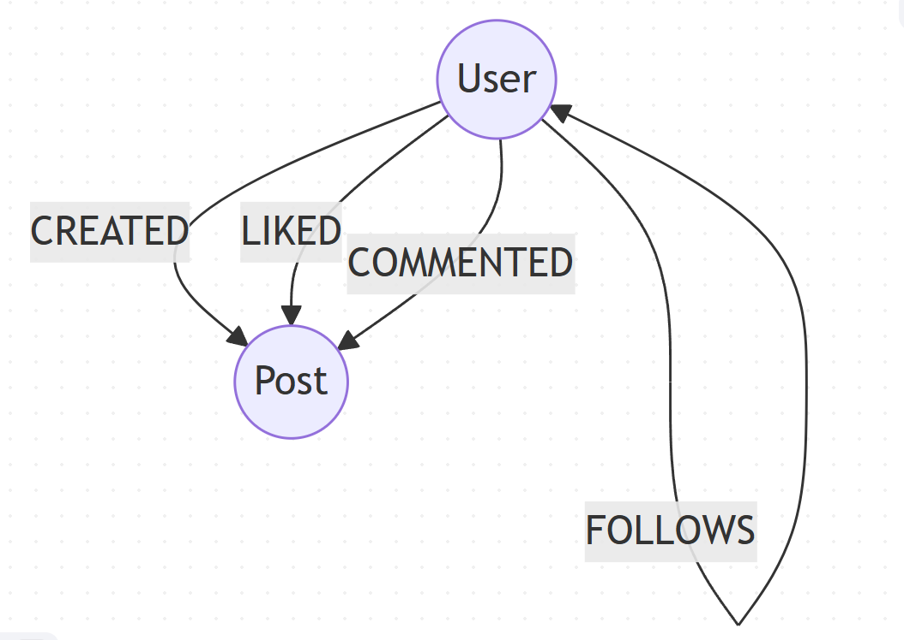

# Desafio DIO - Neo4j

## Contexto
Este repositório contém um projeto educacional simples que demonstra o uso do banco de dados de grafos **Neo4j**. A ideia é modelar um pequeno sistema de rede social onde usuários se conectam, criam posts, curtem e comentam.

O objetivo é ser um exemplo de nível iniciante, seguindo boas práticas de estruturação de projeto para que seja considerado "Nota 10" pelo time de especialistas da Neo4j.

## Por que grafos?
O modelo de grafos facilita a representação de relacionamentos entre entidades de forma natural e performática. Em uma rede social, conexões entre usuários e interações com conteúdo são consultadas com frequência, tornando o uso de grafos uma escolha intuitiva.

## Estrutura do repositório
```
/                 - root do projeto
  README.md       - documentação (este arquivo)
  /data           - CSV de exemplo
  /scripts        - scripts Cypher de carga e queries
  /src            - código de exemplo (Python)
  /images         - diagramas do modelo (opcional)
```

## Instalação e execução
1. **Instale o Neo4j** (você pode usar Neo4j Desktop, Docker ou uma instância hospedada). Version 5.x recomendada.
2. Crie um banco de dados chamado `social` (ou outro de sua preferência).
3. Ative o plugin `apoc` se desejar usar procedimentos auxiliares.
4. Execute o script de carga:
   ```sh
   cypher-shell -u neo4j -p <senha> -f scripts/load_data.cypher
   ```
5. Utilize o `queries.cypher` para explorar as perguntas de negócio.
6. Opcionalmente execute o exemplo em Python:
   ```sh
   python src/example.py
   ```

## Modelagem do grafo
O grafo contém os seguintes labels e relacionamentos:

- `User` com propriedades `id`, `name` e `email`.
- `Post` com propriedades `id`, `content` e `timestamp`.
- `:FOLLOWS` entre usuários.
- `:CREATED` entre usuários e posts.
- `:LIKED` entre usuários e posts.
- `:COMMENTED` entre usuários e posts com propriedade `text`.



> **Diagrama exportado**: Imagem gerada com Mermaid com nós circulares:
>
> ```mermaid
> graph TD
>     classDef circ shape:circle,stroke:#333,fill:#fff;
>     User:::circ
>     Post:::circ
>
>     User-->|FOLLOWS|User
>     User-->|CREATED|Post
>     User-->|LIKED|Post
>     User-->|COMMENTED|Post
> ```


## Dataset e carga
Os arquivos CSV de amostra estão em `data/`. Eles contêm poucas linhas para demonstração.

### Exemplos de comandos Cypher comentados
O arquivo `scripts/load_data.cypher` contém instruções para carregar os CSV e criar os nós e relacionamentos.

## Perguntas de negócio e queries
Algumas perguntas que podemos responder com o grafo:

1. Quem são os amigos mais populares (mais seguidores)?
2. Quais posts de um usuário receberam mais curtidas?
3. Quem comentou mais vezes nos posts de determinado autor?
4. Caminho mais curto entre dois usuários (grau de separação).

O arquivo `scripts/queries.cypher` lista as consultas correspondentes e inclui capturas de tela de resultados.

## Troubleshooting
Algumas dificuldades encontradas durante o desenvolvimento:

- Formatação dos CSVs: tenha atenção às aspas e cabeçalhos.
- Permissões do Neo4j ao acessar arquivos locais: é necessário ajustar `dbms.directories.import` no `neo4j.conf` ou usar `LOAD CSV WITH HEADERS FROM 'file:///...'`.
- Conflitos de versão do driver Python: use `neo4j==5.11.0` para compatibilidade com Neo4j 5.

## Agradecimentos
Projetos de exemplo oficiais estão disponíveis em https://github.com/neo4j-graph-examples. Use-os como inspiração para estruturar projetos profissionais.
